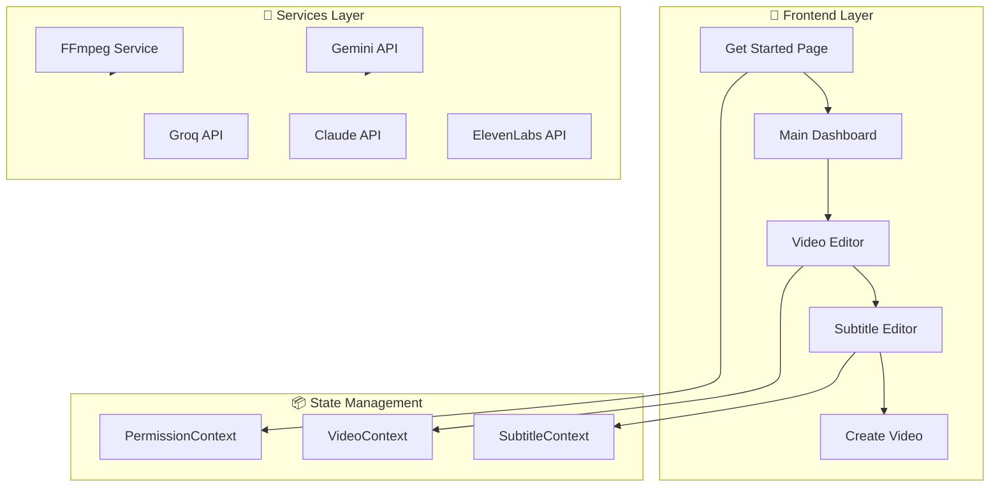
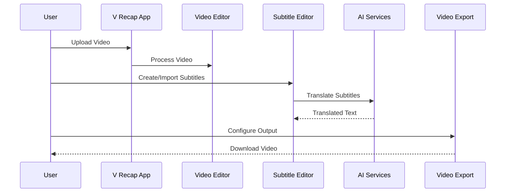
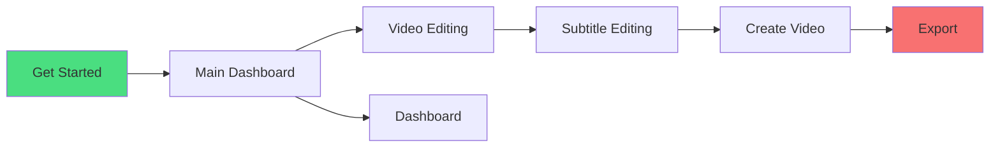
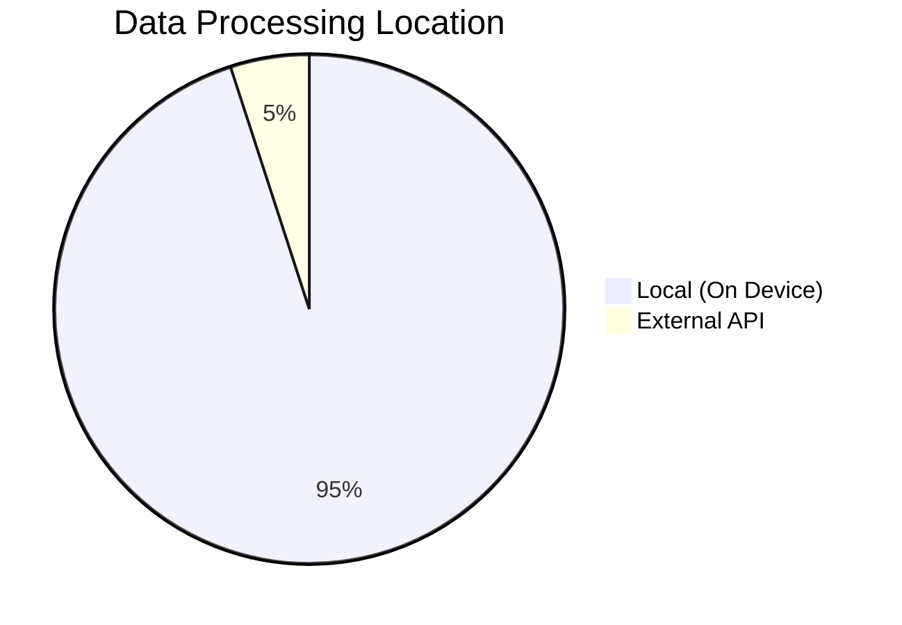

# 🎬 V Recap App

> A modern, privacy-focused video editing application built with React + TypeScript

[](https://react.dev/)
[](https://www.typescriptlang.org/)
[](https://vitejs.dev/)
[](https://tailwindcss.com/)

## 📋 Overview

V Recap is a powerful, mobile-first video editing application that enables creators to edit videos, create subtitles, and translate content with AI-powered features. All processing happens locally — your videos never leave your device.

## 🏗️ Architecture



## 🔄 Workflow



## ✨ Features

### 🎬 Video Editing
- **Drag & Drop Upload** - Support for MP4, MOV, AVI formats
- **Video Player** - Full playback controls with progress bar
- **Editing Tools** - Trim, speed adjustment, rotation, filters
- **Audio Track** - Add custom background music

### 📝 Subtitle Creation
- **Import SRT/VTT** - Load existing subtitle files
- **Visual Editor** - Edit subtitle timing and text
- **Font Designer** - Customize font family, size, color
- **Live Preview** - See subtitles in real-time

### 🌐 AI Translation
- **Multi-language Support** - 10+ languages
- **Powered by Gemini** - High-quality translations
- **Batch Processing** - Translate all subtitles at once
- **Groq Integration** - Fast AI inference

### 📱 Mobile-First Design
- **Touch Optimized** - Large tap targets, smooth gestures
- **Responsive Layout** - Adapts to any screen size
- **Dark Theme** - Easy on the eyes
- **Fast Performance** - Built with Vite

## 🛠️ Tech Stack

| Technology | Purpose |
|------------|---------|
| React 18 | UI Library |
| TypeScript | Type Safety |
| Vite | Build Tool |
| Tailwind CSS | Styling |
| Framer Motion | Animations |
| Zustand | State Management |
| React Router | Navigation |

## 🚀 Getting Started

### Prerequisites
- Node.js 18+
- npm or yarn

### Installation

```bash
# Clone the repository
git clone https://github.com/amkyawdev/v-recap-app.git

# Navigate to project
cd v-recap-app

# Install dependencies
npm install

# Start development server
npm run dev

# Build for production
npm run build
```

### Environment Variables

Create a `.env` file in the root directory:

```env
VITE_GEMINI_API_KEY=your_gemini_api_key
VITE_ELEVENLABS_API_KEY=your_elevenlabs_api_key
VITE_GROQ_API_KEY=your_groq_api_key
VITE_CLAUDE_API_KEY=your_claude_api_key
```

## 📂 Project Structure

```
v-recap-app/
├── public/
│   └── favicon.svg
├── src/
│   ├── components/
│   │   ├── Common/          # Button, DialogBox, SideMenu
│   │   ├── Video/           # VideoPlayer, VideoUploader
│   │   └── Subtitles/       # SubtitleEditor, FontDesigner
│   ├── pages/               # Route components
│   ├── contexts/            # React Context providers
│   ├── hooks/               # Custom hooks
│   ├── services/            # API integrations
│   ├── types/               # TypeScript definitions
│   └── styles/              # Global CSS
├── index.html
├── package.json
├── tailwind.config.js
├── tsconfig.json
└── vite.config.ts
```

## 🎯 Page Flow



## 🔐 Privacy First



- ✅ All video processing happens in your browser
- ✅ No server uploads for video data
- ✅ API calls only for translation services
- ✅ Your content stays on your device

## 📦 Components

### Common Components
- `Button` - Customizable button with variants
- `DialogBox` - Modal dialog with animations
- `HamburgerMenu` - Mobile navigation
- `SideMenu` - Slide-out navigation panel
- `LoadingAnimation` - Loading spinner

### Video Components
- `VideoPlayer` - Full-featured video player
- `VideoUploader` - Drag & drop file upload
- `EditingTools` - Video editing controls
- `AudioUploader` - Background music upload

### Subtitle Components
- `SubtitleEditor` - Timeline subtitle editor
- `SubtitleUploader` - SRT/VTT file import
- `FontDesigner` - Typography customization
- `TranslationTools` - AI translation panel

## 🎨 Design System

### Colors
```css
/* Primary Blue */
--blue-700: #1d4ed8
--blue-800: #1e3a5f
--blue-900: #1e3a5f

/* Accent Red */
--accent-400: #f87171
--accent-500: #ef4444
--accent-600: #dc2626
```

### Typography
- **Font Family**: Inter
- **Headings**: Bold, 2xl-4xl
- **Body**: Regular, base-lg

## 📄 License

MIT License - feel free to use this project for personal or commercial purposes.

---

<div align="center">
  <p>Made with ❤️ using React & TypeScript</p>
  <p>© 2024 V Recap. All rights reserved.</p>
</div>